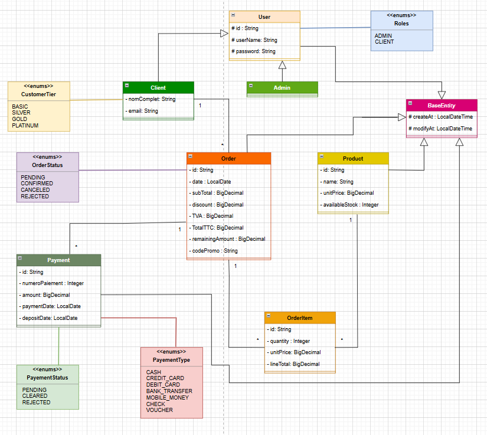
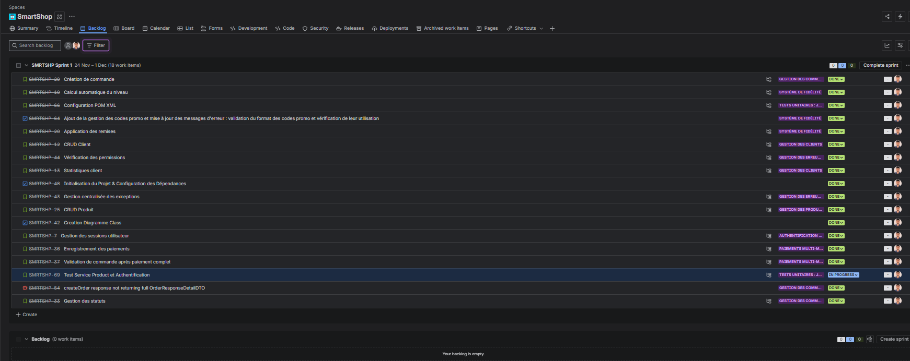
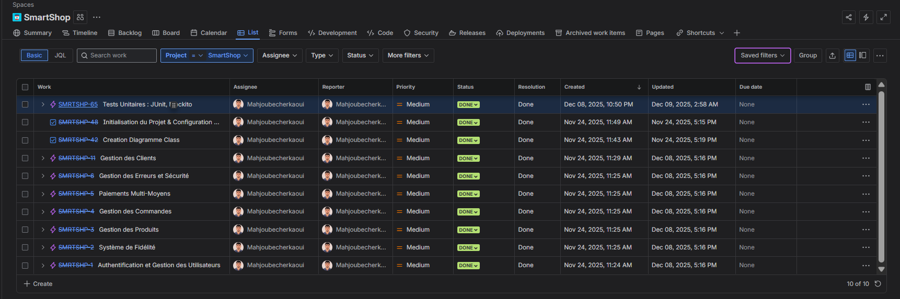
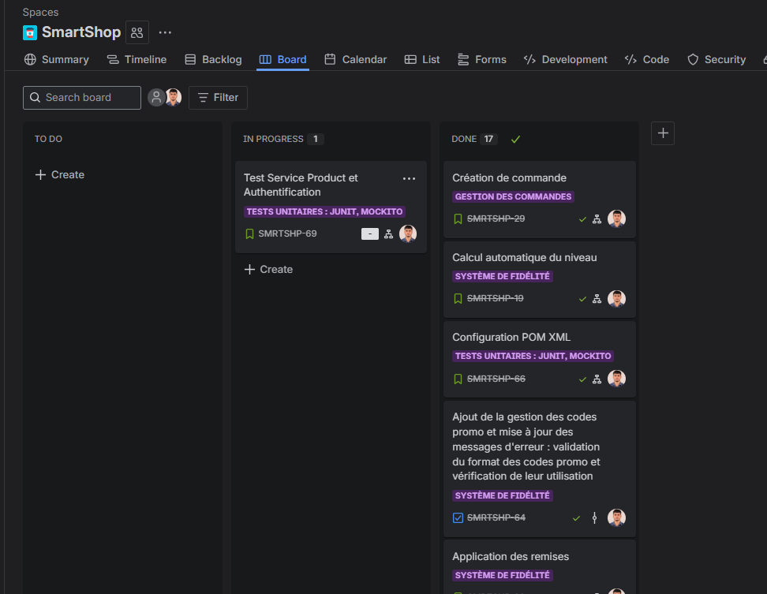
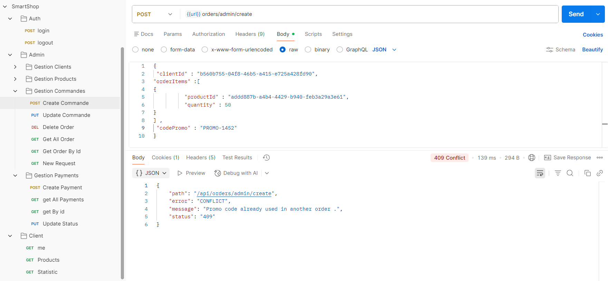
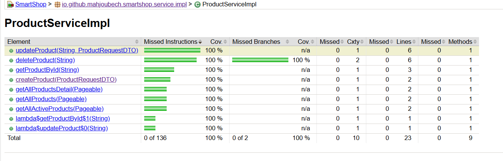
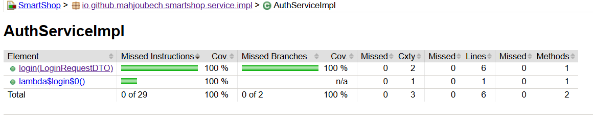

Parfait 😄 ! On peut maintenant générer un **README.md** pour ton projet **SmartShop** en utilisant ta structure de projet et toutes les informations que tu viens de donner. On va inclure :

* Contexte détaillé et objectifs du projet
* Architecture backend REST (Controller → Service → Repository → DTO → Mapper → Entity)
* Fonctionnalités principales : Clients, Produits, Commandes, Paiements, Niveau de fidélité
* Règles métiers critiques et validations
* Structure du projet basée sur ton arborescence actuelle
* Tests (JUnit/Mockito/Postman/Swagger)
* Placeholders pour images (diagrammes UML, Postman, Jira, JaCoCo) avec cadre coloré et icônes
* Modalité pédagogique et critères de réussite

Voici un exemple de **README.md** prêt à copier et adapter :

````markdown
# 🛒 SmartShop – Backend REST API pour MicroTech Maroc

### Gestion commerciale et financière des clients B2B (650 clients actifs) via API REST.

---

## 🌟 Contexte du Projet

SmartShop est une application web backend pour **MicroTech Maroc**, distributeur B2B de matériel informatique basé à Casablanca.  
Elle permet de :

- Gérer un portefeuille de clients avec système de fidélité (BASIC, SILVER, GOLD, PLATINUM)
- Suivre toutes les commandes et paiements fractionnés multi-moyens
- Assurer la traçabilité complète des événements financiers
- Optimiser la gestion de la trésorerie  

**Notes importantes :**  
- Purement backend REST (pas d’interface graphique)  
- Tests et démonstrations via **Postman** ou **Swagger**  
- Authentification par **HTTP Session** (login/logout)  
- Gestion des rôles : `ADMIN` et `CLIENT`  

---

## 🏛️ Architecture Technique

**Architecture en couches :**

| Couche | Description |
| :--- | :--- |
| **Controller** | Expose endpoints REST (Clients, Orders, Products, Payments) |
| **Service** | Logique métier et transactions via `@Transactional` |
| **Repository** | Accès aux données via Spring Data JPA |
| **Entity** | Modélisation des objets persistants |
| **DTO** | Transfert structuré de données entre couches |
| **Mapper** | Conversion Entity ↔ DTO via MapStruct |

**Structure de projet actuelle :**

```plaintext
📁 SmartShop/
├── src/main/java/io/github/mahjoubech/smartshop/
│   ├── config/
│   ├── controller/
│   ├── dto/
│   ├── exception/
│   ├── mapper/
│   ├── model/
│   ├── repository/
│   ├── service/
│   ├── utils/
│   └── SmartShopApplication.java
├── src/main/resources/
│   └── application.properties
├── src/test/java/io/github/mahjoubech/smartshop/
│   └── service/SmartShopApplicationTests.java
└── docs/
    ├── diagram.png
    ├── postman.png
    ├── jira.png
    └── jacoco.png
````

---

## 🛠️ Fonctionnalités Principales

### 1️⃣ Gestion des Clients

* CRUD complet sur clients
* Suivi automatique : total commandes, montant cumulé, première et dernière commande
* Historique commandes avec identifiant, date, total TTC, statut (PENDING, CONFIRMED, CANCELED, REJECTED)

### 2️⃣ Système de Fidélité Automatique

* **Niveaux :** BASIC / SILVER / GOLD / PLATINUM
* Calcul automatique selon historique commandes et montant cumulé
* Application des remises sur futures commandes

### 3️⃣ Gestion des Produits

* CRUD avec **soft delete**
* Filtrage et pagination
* Vérification stock avant suppression

### 4️⃣ Gestion des Commandes

* Multi-produits avec quantités
* Validation stock et règles métiers
* Application des remises fidélité et code promo
* Calcul automatique : sous-total HT, remise, TVA, total TTC
* Mise à jour stock et statistiques client après confirmation
* Statuts : PENDING, CONFIRMED, CANCELED, REJECTED

### 5️⃣ Gestion des Paiements

* Multi-moyens : ESPÈCES, CHÈQUE, VIREMENT
* Paiement fractionné autorisé
* Validation commandes CONFIRMED uniquement si montant_restant = 0

---

## 🚀 Technologies Utilisées

| Technologie              | Rôle                            |
| :----------------------- | :------------------------------ |
| Java 17+ / Maven         | Backend                         |
| Spring Boot 3 / Data JPA | Framework REST / ORM            |
| PostgreSQL               | Base relationnelle              |
| MapStruct                | Mapping DTO ↔ Entity            |
| JUnit 5 / Mockito        | Tests unitaires                 |
| Swagger                  | Documentation API               |
| HTTP Session             | Authentification (login/logout) |

---

## 📸 Tests et Documentation

### UML Diagram



### Jira Board





### Postman



### Couverture de tests (JaCoCo)





---

## ⚙️ Lancement de l’Application

1. Configurer PostgreSQL dans `application.properties`
2. Compiler et lancer :

```bash
mvn clean install
mvn spring-boot:run
```

---

## 🧾 Modalité Pédagogique & Critères de Réussite

* Date de lancement : 24/11/2025
* Date limite : 28/11/2025
* Livrables : code source GitHub, diagramme UML, projet Jira, README complet
* L’application doit démarrer sans erreur, avec validations, remises, TVA et stock corrects
* Les erreurs doivent être gérées et renvoyées au format JSON cohérent
* Architecture claire et maintenable (Controller-Service-Repository-DTO-Mapper)

---

## 📧 Contact

**👤 Mahjoub Cherkaoui**
📧 [mahjoubcherkaoui50@gmail.com](mailto:mahjoubcherkaoui@gmail.com)
💼 [GitHub – Mahjoubech](https://github.com/Mahjoubech)

```
